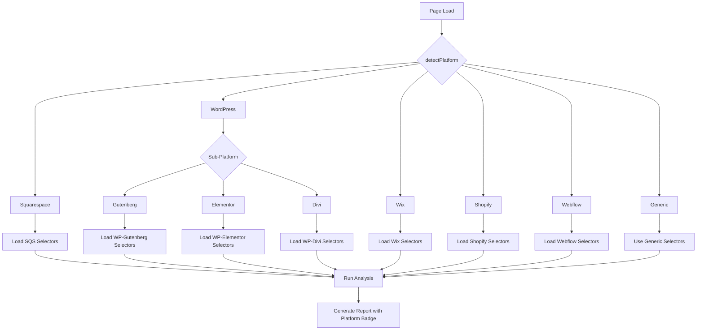

# Multi-Platform Detection Architecture

**Date**: January 29, 2026  
**Purpose**: System design for platform-specific analysis in Website Style Analyzer Pro  
**Status**: Design Document (Implementation Pending)

---

## Overview

The multi-platform detection system enables the generic version of Website Style Analyzer Pro to automatically detect website platforms (Squarespace, WordPress, Wix, Shopify, Webflow) and apply platform-specific analysis factors to improve accuracy and provide enhanced value.

---

## Platform Factor Summary

| Platform        | Factor Count | Key Strength                                                          |
| --------------- | ------------ | --------------------------------------------------------------------- |
| **Squarespace** | 40           | Consistent `.sqs-*` classes, stable `data-section-id`/`data-block-id` |
| **WordPress**   | 50           | Sub-platform detection (Gutenberg/Elementor/Divi), rich CSS variables |
| **Wix**         | 45           | Stable `comp-*` IDs, `data-testid` semantic attributes                |
| **Shopify**     | 47           | Section/block architecture, product/cart data attributes              |
| **Webflow**     | 52           | Clean semantic HTML, consistent `.w-*` framework classes              |
| **Generic**     | ~15          | Standard HTML elements, common class patterns                         |

---

## Architecture Diagram



---

## File Structure

```
wxt-version/src/platforms/
├── index.ts                 # Platform detection and routing
├── types.ts                 # Shared types
├── squarespace/
│   ├── selectors.ts         # SQS-specific selectors
│   └── themeCapture.ts      # SQS theme variables
├── wordpress/
│   ├── selectors.ts         # WP selectors (Gutenberg base)
│   ├── elementor.ts         # Elementor-specific
│   ├── divi.ts              # Divi-specific
│   └── themeCapture.ts      # WP CSS variables
├── wix/
│   ├── selectors.ts         # Wix selectors
│   └── themeCapture.ts      # Wix global classes
├── shopify/
│   ├── selectors.ts         # Shopify selectors
│   └── themeCapture.ts      # Shopify CSS variables
├── webflow/
│   ├── selectors.ts         # Webflow selectors
│   └── themeCapture.ts      # Webflow CSS properties
└── generic/
    └── selectors.ts         # Fallback generic selectors
```

---

## Core Interfaces

### PlatformInfo

```typescript
// src/platforms/types.ts

export type Platform =
  | 'squarespace'
  | 'wordpress'
  | 'wordpress-elementor'
  | 'wordpress-divi'
  | 'wix'
  | 'shopify'
  | 'webflow'
  | 'generic';

export interface PlatformInfo {
  platform: Platform;
  detected: boolean;
  factorCount: number;
  displayName: string;
  message: string; // For popup notification
  reportBadge: string; // For report header
}

export interface PlatformSelectors {
  buttons: string[];
  navigation: string[];
  headings: string[];
  paragraphs: string[];
  images: string[];
  links: string[];
  sections: string[];
  blocks: string[];
}

export interface PlatformConfig {
  info: PlatformInfo;
  selectors: PlatformSelectors;
  dataAttributes: string[];
  cssVariables: string[];
  unstableIdPatterns: RegExp[];
  recommendedDelay: number;
}
```

---

## Detection Logic

### Platform Priority

Detection runs in this order (first match wins):

1. **Squarespace** - Most specific indicators (.sqs- classes, YUI references)
2. **Shopify** - Enhanced detection (CDN links, payment buttons, window.Shopify, and checkout meta tags)
3. **Webflow** - `data-wf-*` attributes are unique
4. **WordPress** - Then sub-detect builder (Elementor/Divi/Gutenberg)
5. **Wix** - `comp-*` IDs and data-testid
6. **Generic** - Fallback

### Detection Functions

```typescript
// src/platforms/index.ts

export function detectPlatform(): PlatformInfo {
  // 1. Squarespace
  if (isSquarespace()) {
    return {
      platform: 'squarespace',
      detected: true,
      factorCount: 40,
      displayName: 'Squarespace',
      message: 'Squarespace detected. Using 40 platform-specific analysis factors.',
      reportBadge: 'Platform: Squarespace • Enhanced analysis with 40 platform-specific factors',
    };
  }

  // 2. Shopify
  if (isShopify()) {
    return {
      platform: 'shopify',
      detected: true,
      factorCount: 47,
      displayName: 'Shopify',
      message: 'Shopify detected. Using 47 platform-specific analysis factors.',
      reportBadge: 'Platform: Shopify • Enhanced analysis with 47 platform-specific factors',
    };
  }

  // 3. Webflow
  if (isWebflow()) {
    return {
      platform: 'webflow',
      detected: true,
      factorCount: 52,
      displayName: 'Webflow',
      message: 'Webflow detected. Using 52 platform-specific analysis factors.',
      reportBadge: 'Platform: Webflow • Enhanced analysis with 52 platform-specific factors',
    };
  }

  // 4. WordPress (with sub-detection)
  if (isWordPress()) {
    if (isElementor()) {
      return {
        platform: 'wordpress-elementor',
        detected: true,
        factorCount: 50,
        displayName: 'WordPress (Elementor)',
        message: 'WordPress with Elementor detected. Using 50 platform-specific analysis factors.',
        reportBadge:
          'Platform: WordPress (Elementor) • Enhanced analysis with 50 platform-specific factors',
      };
    }
    if (isDivi()) {
      return {
        platform: 'wordpress-divi',
        detected: true,
        factorCount: 50,
        displayName: 'WordPress (Divi)',
        message: 'WordPress with Divi detected. Using 50 platform-specific analysis factors.',
        reportBadge:
          'Platform: WordPress (Divi) • Enhanced analysis with 50 platform-specific factors',
      };
    }
    return {
      platform: 'wordpress',
      detected: true,
      factorCount: 50,
      displayName: 'WordPress',
      message: 'WordPress detected. Using 50 platform-specific analysis factors.',
      reportBadge: 'Platform: WordPress • Enhanced analysis with 50 platform-specific factors',
    };
  }

  // 5. Wix
  if (isWix()) {
    return {
      platform: 'wix',
      detected: true,
      factorCount: 45,
      displayName: 'Wix',
      message: 'Wix detected. Using 45 platform-specific analysis factors.',
      reportBadge: 'Platform: Wix • Enhanced analysis with 45 platform-specific factors',
    };
  }

  // 6. Generic fallback
  return {
    platform: 'generic',
    detected: false,
    factorCount: 0,
    displayName: 'Website',
    message: '',
    reportBadge: '',
  };
}
```

---

## Selector Loading

### Dynamic Selector Merging

```typescript
// src/platforms/index.ts

export function getSelectorsForPlatform(platform: Platform): PlatformSelectors {
  const genericSelectors = getGenericSelectors();
  const platformSelectors = getPlatformSpecificSelectors(platform);

  // Merge with platform-specific selectors first (higher priority)
  return {
    buttons: [...platformSelectors.buttons, ...genericSelectors.buttons],
    navigation: [...platformSelectors.navigation, ...genericSelectors.navigation],
    headings: [...platformSelectors.headings, ...genericSelectors.headings],
    paragraphs: [...platformSelectors.paragraphs, ...genericSelectors.paragraphs],
    images: [...platformSelectors.images, ...genericSelectors.images],
    links: [...platformSelectors.links, ...genericSelectors.links],
    sections: [...platformSelectors.sections, ...genericSelectors.sections],
    blocks: [...platformSelectors.blocks, ...genericSelectors.blocks],
  };
}
```

---

## Messaging Implementation

### Popup UI Location

The platform detection message appears in two states:

1. **Before Analysis**: Below the site URL area
2. **After Analysis**: Below the export buttons (to preserve screen real estate)

```html
<!-- Platform detection banner -->
<div id="platformDetectionBanner" class="platform-banner" style="display: none;">
  <span id="platformMessage"></span>
</div>
```

### CSS Styling

```css
/* Platform detection banner - subtle, informative */
.platform-banner {
  background: linear-gradient(135deg, rgba(59, 130, 246, 0.1), rgba(147, 51, 234, 0.1));
  border: 1px solid rgba(59, 130, 246, 0.2);
  border-radius: 6px;
  padding: 8px 12px;
  margin: 8px 0;
  font-size: 12px;
  color: #475569;
  text-align: center;
}

.platform-banner.detected {
  background: linear-gradient(135deg, rgba(34, 197, 94, 0.1), rgba(59, 130, 246, 0.1));
  border-color: rgba(34, 197, 94, 0.3);
}
```

### Report Header

```html
<!-- In HTML report, above the date -->
<div class="report-platform-badge">
  Platform: Squarespace • Enhanced analysis with 40 platform-specific factors
</div>
<div class="report-date">Generated: January 29, 2026</div>
```

---

## Adaptive Timing

Each platform has a recommended analysis delay:

| Platform    | Delay (ms) | Reason                     |
| ----------- | ---------- | -------------------------- |
| Squarespace | 3000       | Heavy JS initialization    |
| WordPress   | 2000       | Plugin lazy loading        |
| Elementor   | 2500       | Widget initialization      |
| Wix         | 2500       | Thunderbolt hydration      |
| Shopify     | 2000       | Dynamic cart/checkout      |
| Webflow     | 2000       | Interaction initialization |
| Generic     | 1000       | Standard page load         |

---

## Unstable ID Filtering

Each platform defines patterns for IDs that should be filtered from generated selectors:

```typescript
const UNSTABLE_ID_PATTERNS: Record<Platform, RegExp[]> = {
  squarespace: [/^yui_/],
  wordpress: [/^et_pb_\w+_\d+$/], // Divi ordered IDs
  'wordpress-elementor': [/^elementor-element-/],
  'wordpress-divi': [/^et_pb_\w+_\d+$/],
  wix: [/^Stylable[A-Z]/],
  shopify: [/^cart-notification-/, /^popup-/],
  webflow: [], // Webflow IDs are generally stable
  generic: [],
};
```

---

## Integration Points

### 1. Content Script Initialization

```typescript
// In content script
import { detectPlatform, getSelectorsForPlatform } from './platforms';

const platformInfo = detectPlatform();
const selectors = getSelectorsForPlatform(platformInfo.platform);
const delay = getDelayForPlatform(platformInfo.platform);

// Store for report metadata
window.__platformInfo = platformInfo;
```

### 2. Popup UI (Centralized Injection)

```typescript
// In popup/main.ts
async checkCurrentSite() {
  // ... safety checks for restricted URLs ...

  // Platform detection (generic version only)
  if (!isSqs) {
    // Injects the centralized detectPlatform function directly into the page context
    await this.detectPlatformForBanner(tab.id!);
  }
}
```

> [!IMPORTANT]
> To ensure the popup and the core analyzer always agree on the platform, the popup now uses the **centralized** `detectPlatform` utility from `src/platforms/index.ts`. This eliminates duplication and ensures that fixes to detection (like the 2026-01-31 Shopify enhancement) apply globally.

### 3. Report Generation

```typescript
// In export-html-reports.ts
function generateReportHeader(data, platformInfo) {
  let platformBadge = '';
  if (platformInfo && platformInfo.detected) {
    platformBadge = `<div class="platform-badge">${platformInfo.reportBadge}</div>`;
  }

  return `
    <header>
      ${platformBadge}
      <div class="report-date">Generated: ${new Date().toLocaleDateString()}</div>
    </header>
  `;
}
```

---

## Future Enhancements

1. **Additional Platforms**: Ghost, Drupal, Joomla, Weebly
2. **Theme Detection**: Identify specific themes within platforms
3. **Version Detection**: Detect platform versions (e.g., Shopify OS 2.0)
4. **Confidence Scoring**: Return detection confidence percentage
5. **Multi-Platform Sites**: Handle hybrid sites (e.g., Shopify with custom WP blog)

---

## Related Documentation

- [squarespace-specific-elements.md](./squarespace-specific-elements.md)
- [wordpress-specific-elements.md](./wordpress-specific-elements.md)
- [wix-specific-elements.md](./wix-specific-elements.md)
- [shopify-specific-elements.md](./shopify-specific-elements.md)
- [webflow-specific-elements.md](./webflow-specific-elements.md)
